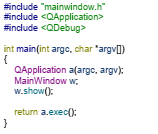

# Gerenciador de Estoque
### Código exemplo da aplicação desenvolvida em [QT](http://www.qt.io) para gerenciar o estoque de uma loja de eletrônica (Arduíno, sensores, etc).
#### Este código foi desenvolvido por EDER MADRUGA COELHO (20181610028) na disciplina de Técnicas de Programação (2018.2) tendo como base o código Gerenciador de alunos 2018.2 do professor PATRIC LACOUTH.

A aplicação deve permitir ao usuário a inserção de vários produtos da loja de eletrônica, mostrando-os em uma tabela (TableWidget), onde será possível a ordenação pelo Item (Produto) ou pela Quantidade. É possível que o usuário salve a Lista de Produtos em um arquivo de texto (.txt) ou que o mesmo carregue essa lista de um arquivo. Além disso é permitido ao usuário e exclusão de um item bem como sua edição. A Figura abaixo mostra a tela inicial da aplicação.

É possível visualizar uma tela de estatísticas onde teremos um resumo que informa ao usuário a quantidade total de itens do estoque, bem como a menor quantidade e também a maior. Na figura abaixo, é possível ver esta tela.

A utilização do formulário é bastante intuitiva. Observe na figura abaixo os diversos itens do formulário e a ação de sua interação com o usuário.

## Menu Arquivo

Neste Menu podemos acessar as opções de Salvar ou Carregar uma lista de Itens. O formato do arquivo será .txt.

## Tela Inserir

Nesta Tela faremos a inserção do Item bem como a sua quantidade. Também é possível por meio dela acessar outras funções como ordenação, Exclusão, e Edição.

## Tela Estatísticas

Nesta tela é possível ver um pequeno resumo do estoque da loja, como: Quantidade Total de Itens, Maior Quantidade e Menor Quantidade.

## Controle do Formulário

Nestas opções, podemos Fechar, Minimizar ou expandir o formulário.

## Inserção do Item

Neste Campo digitaremos o produto a ser inserido. Mesmo que a escrita seja em caixa alta ou baixa, o Item será guardado sempre em caixa alta. Não é possível inserir um item se o mesmo já foi inserido anteriormente

## Inserção da Quantidade

Neste campo digitaremos a quantidade do Item. Se a quantidade for maior que 10, o estoque do Item será classificado como alto, caso contrário, será classificado como baixo.

## Botão Inserir

Ao ser pressionado, e não havendo duplicidade, o item com sua respectiva quantidade e classificação será inserida na tabela.

## Tabela de Produtos

Este Item mostrará todos os produtos inseridos.

## Botão Ordenar por Produto

Ao Clicar neste botão, a Lista de produtos será ordenada em ordem alfabética.

## Botão Ordenar por Quantidade

Ao Clicar neste botão, a Lista de produtos será ordenada considerando a quantidade de itens de cada produto. Caso dois itens tenha a mesma quantidade, será considerada a ordenação alfabética.

## Botão Excluir

Antes de utilizar este botão, é necessário que o usuário selecione uma linha da tabela. Com isso, ao clicar no botão a linha selecionada será apagada.

## Botão Editar

Antes de utilizar este botão, é necessário que o usuário selecione uma linha da tabela. Com isso, ao clicar no botão a linha selecionada será apagada, mas o item com sua respectiva quantidade retornará ao campo de edição para que possa ser modificado e inserido novamebte na tabela.

# Inserindo Produtos na Tabela

Para Inserir produtos da tabela, basta preencher o campo Produto e o campo Quantidade e clicar no botão inserir. O Produto então será inserido na tabela juntamente com sua quantidade e a situação do estoque. Se a quantidade for igual ou superior a 10, o item será classificado como ALTO, caso contrário, será classificado como baixo. Como exemplo, vamos inserir em nossa tabela os seguintes itens:

- Arduino uno (10 peças)
- Arduino Mega (5 peças)
- Sensor Ultrassõnico (21 peças)
- Motor de Passo (3 peças)
- Drive para motor de passo (1 peça)

Ao ser inserido, nosso formulário ficará da seguinte forma:

Suponha agora, que o usuário tente digitar novamente o primeiro item (Arduino Uno), como podemos ver na figura abaixo:

Ao clicar no botão INSERIR, uma janela de mensagem avisará da duplicidade do item.

Dessa forma não será possível termos dois itens iguais cadastrados.

# Ordenando por Produto

Se o usuário desejar ordenar a lista de produtos por ordem alfabética basta clicar no botão ORDENAR POR PRODUTO. Nossa lista do exemplo dado ficará:

# Ordenando por Quantidade

Se o usuário desejar ordenar a lista de produtos por quantidade basta clicar no botão ORDENAR POR QUANTIDADE. Nossa lista do exemplo dado ficará:

# Editando um Produto

Caso seja necessário, o usuário poderá editar o produto, basta selecionar uma linha da tabela (Observe que a linha selecionada ficará azul)e apertar no botão EDITAR. O item será apagado, mas o produto aparecerá nos campos de inserção, podendo ser editados e inseridos novamente.

Suponha que seja necessário modificar a quantidade do arduino Uno para 20 peças, neste caso, procedemos:

- Selecionamos a linha.

- Clicamos no botão EDITAR.

- A Linha será apagada e o item voltará aos campos de inserção.

- Modificamos a quantidade para 20 e clicamos em INSERIR

# Excluindo um Produto

Caso seja necessário, o usuário poderá excluir um produto, basta selecionar uma linha da tabela (Observe que a linha selecionada ficará azul)e apertar no botão EXCLUIR. O item será apagado.

Suponha que seja necessário excluir o item Arduino Mega:

- Selecionamos a linha.

- Clicamos no botão EXCLUIR. Uma janela de mensagem será aberta informando da excusão do item.

# Salvando a tabela em um arquivo de Texto

É possível salvar a tabela de produtos em um arquivo de texto, para tanto, procedemos de saguinte maneira:

- Clicamos em ARQUIVO e em seguida salvar.

- Uma janela de dialogo é aberta para selecionarmos o nome do arquivo. No nosso exemplo, vamos salvar como ESTOQUE.txt.

- Se o arquivo foi salvo, uma janela de mensagem nos informará.

# Carregando uma tabela de um arquivo de texto

É possível carregar um arquivo já salvo no formato .txt. Para tanto:

- Clicamos em ARQUIVO e em seguida CARREGAR.

- Selecionamos o arquivo que desejamos carregar.

# Verificando as Estatísticas do Estoque

A qualquer momento, podemos verificar as estatísticas do estoque, bastanto clicar em ESTATÍSTICAS:

____________________________________________________________________________________________________________

# A Programação por trás do formulário

Toda Programação deste formulário foi concebida em Classes, conforme podemos ver na árvore do projeto no QT.

A Programação do formulário mainwindow ocorre em sua classe. Como Header desta classe, temos:

Podemos ver melhor a programação dessa classe em Source:

Já o Header da Classe Produto podemos observar abaixo.

Essa classe é responsável por setar o Item e a quantidade do produto, conforme observamos no source da classe:

Em seguida, vemos o Header da Classe Loja.

E seu respectivo Source:

Essa classe é responsável por montar o estoque da loja, bem como fazer a ordenação, edição e exclusão dos produtos.

A próxima classe mostrada no Header abaixo é a classe do gerenciador de arquivos.

Cujo Source vemos abaixo.

Como o próprio nome diz, essa classe lida com a criação e leitura de arquivos .txt.

Por fim é mostrada abaixo a função main.

